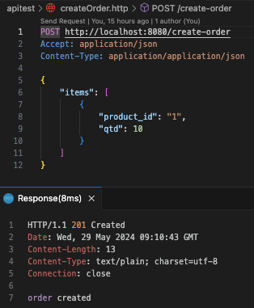
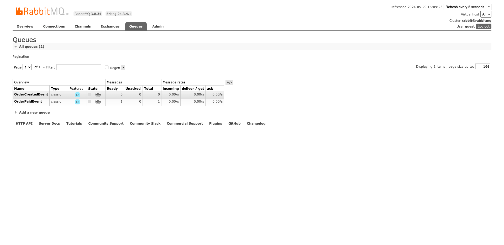

# Event-Driven Architecture in Go

This project demonstrates an event-driven architecture using Go. It includes a simple example of creating an order, processing order payment, updating stock movement, and sending an order email.

## Table of Contents

- [Getting Started](#getting-started)
- [Architecture](#architecture)
- [Usage](#usage)
- [Contributing](#contributing)
- [License](#license)

## Getting Started

### Prerequisites

- Go 1.16 or higher
- RabbitMQ

### Installation

1. Clone the repository:

    ```sh
    git clone https://github.com/AdiPP/go-event-driven.git
    cd go-event-driven
    ```

2. Install dependencies:

    ```sh
    go mod tidy
    ```

3. Ensure RabbitMQ is running locally:

    ```sh
    docker compose up -d
    ```

## Architecture

The project is structured as follows:

- `main.go`: The entry point of the application.
- `internal/application/controller`: Contains the HTTP controllers.
- `internal/application/usecase`: Contains the use cases for the application.
- `internal/domain/event`: Contains the domain events.
- `internal/infra/queue`: Contains the queue adapter implementation (RabbitMQ in this case).

### Flow

1. The client sends a POST request to create an order.
2. The `OrderController` handles the request and triggers the `CreateOrderUseCase`.
3. The `CreateOrderUseCase` publishes an `OrderCreatedEvent` to the RabbitMQ queue.
4. The application listens for the `OrderCreatedEvent` and processes it through various handlers: `ProcessOrderPayment`, `StockMovement`, and `SendOrderEmail`.

## Usage

### Running the Application

1. Start the application:

    ```sh
    go run main.go
    ```

2. The server will start and listen on port 8080.

### API Endpoints

- **Create Order**: `POST /create-order`
  - This endpoint is used to create a new order.

### Example Request

```sh
curl -X POST http://localhost:8080/create-order -H "Accept: application/json" -H "Content-Type: application/json" -d '{"items":[{"product_id":"1","qtd":10}]}'
```

## Sample Screenshots

### API Request


### RabbitMQ Management


### Console Output


## Contributing

Contributions are welcome! Please fork this repository and submit a pull request.

## License

This project is licensed under the MIT License.
